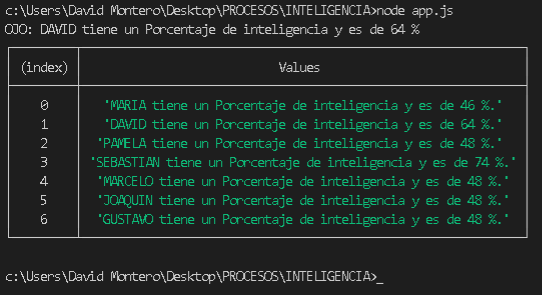

# INTELIGENCIA
  
## Decir si un nombre le da un porcentaje de inteligencia dada

### Ejemplos

1. MARIA
   1. Convertir a mayusculas el nombre: ["MARIA"]
   2. Ver las veces repetida un caracter dentro del nombre: [1,2,1,1]
   3. Sumar extremos y medios: [2,3]
   4. Convertirlo a un numero con baase 10:  [23]
   5. Multiplicarlo por 2: [46]
   6. Entregarlo como porcentaje: ["46 % de inteligencia"]
2. david
   1. Convertir a mayusculas el nombre: ["DAVID"]
   2. Ver las veces repetida un caracter dentro del nombre: [2,1,1,1]
   3. Sumar extremos y medios: [3,2]
   4. Convertirlo a un numero con baase 10:  [32]
   5. Multiplicarlo por 2: [64]
   6. Entregarlo como porcentaje: ["64 % de inteligencia"]
3. Pamela
   1. Convertir a mayusculas el nombre: ["PAMELA"]
   2. Ver las veces repetida un caracter dentro del nombre: [1,2,1,1,1]
   3. Sumar extremos y medios: [2,4]
   4. Convertirlo a un numero con baase 10:  [24]
   5. Multiplicarlo por 2: [48]
   6. Entregarlo como porcentaje: ["48 % de inteligencia"]

### Código(en [app.js](./app.js) )

``` javascript
function repetidos(nombre) {
    let nuevoNombre = nombre.toString().trim().toUpperCase();
    let reps = [];
    let resultado = [];
    let contaRepet = 0;
    let indiceBorrar = -1;
    for (var i = 0; i <= nuevoNombre.length; i++) {
        contaRepet = 1;
        indiceBorrar = -1;
        for (var j = i + 1; j <= nuevoNombre.length; j++) {
            if (nuevoNombre[j] === nuevoNombre[i]) {
                contaRepet++;
                indiceBorrar = j;
            }
        }
        //Add element to end of array
        reps.push({
            letra: nombre[i],
            cantidad: contaRepet,
            borrarAlfinal: indiceBorrar
        });

    }

    //Poner en el nuevo arreglo 
    for (let i = 0; i < reps.length; i++) {
        /*Aquellos elementos que no sean por letra con valor undefined y aque -
          llos que sean de indice borrar al final*/
        if (i !== reps[i].borrarAlfinal && reps[i].letra !== undefined) {
            resultado.push(reps[i]);
        }
    }
    // Retornar resultado con sus propiedades para ser usado más adelante.
    return resultado;
}

function extremosYMedios(repetidos) {
    let extAndMid = [];
    extAndMid.push(repetidos[0]); //Inicial
    extAndMid.push(repetidos[repetidos.length - 2]); //Final
    return extAndMid;
}

function sumaExtrYMedios(repetidos) {
    let extAndMidSUM = [];
    let resultado = [];

    extAndMidSUM.push(repetidos[0].cantidad); //Inicio
    extAndMidSUM.push(repetidos[repetidos.length - 2].cantidad); //Fin

    let sumaExtremos = extAndMidSUM[0] + extAndMidSUM[1];

    let sumaMedios = 0;

    for (let i = 1; i < repetidos.length - 2; i++) {
        sumaMedios += repetidos[i].cantidad;
    }

    extAndMidSUM.push(sumaMedios); //Medios

    resultado.push(sumaExtremos); //index = 0
    resultado.push(sumaMedios); //index = 1

    return resultado;
}

function aBase10(extremos_y_medios) {
    return [2 * ((extremos_y_medios[0] * 10) + extremosYMedios[1])];
}

function convertirAPorcentaje(numBase10) {
    return [parseFloat(numBase10.toString())];
}

function convertirAPorcentaje(porcentaje) {
    return `Porcentaje de inteligencia y es de ${porcentaje} %`;
}
//Pruebas unitarias
let nombre = "David";
let extremosMedios = sumaExtrYMedios(repetidos(nombre));
let numeroBase = 2 * (extremosMedios[0] * 10 + extremosMedios[1]);
let aPorcentaje = convertirAPorcentaje(numeroBase);

//Mostrar resultado Prueba unitaria:
console.log(`OJO: ${nombre.toUpperCase()} tiene un ${aPorcentaje}`);

//Pruebas para grupos:
let nombres = ["MARIA", "david", "PamelA", "Sebastian", "Marcelo", "Joaquin", "Gustavo"];
//Saca los porcentajes grupales
let porcentajesNombres = nombres.map(losNombres => {
    let nombre = losNombres;
    let extremosMedios = sumaExtrYMedios(repetidos(nombre));
    let numeroBase = 2 * (extremosMedios[0] * 10 + extremosMedios[1]);
    let aPorcentaje = convertirAPorcentaje(numeroBase);
    return `${nombre.toUpperCase()} tiene un ${aPorcentaje}.`;
});

//Mostrar resultado Prueba grupal de la data:
console.table(porcentajesNombres)
```

### Resultados

 

## Comentarios

> Nunca dejes de aprender
